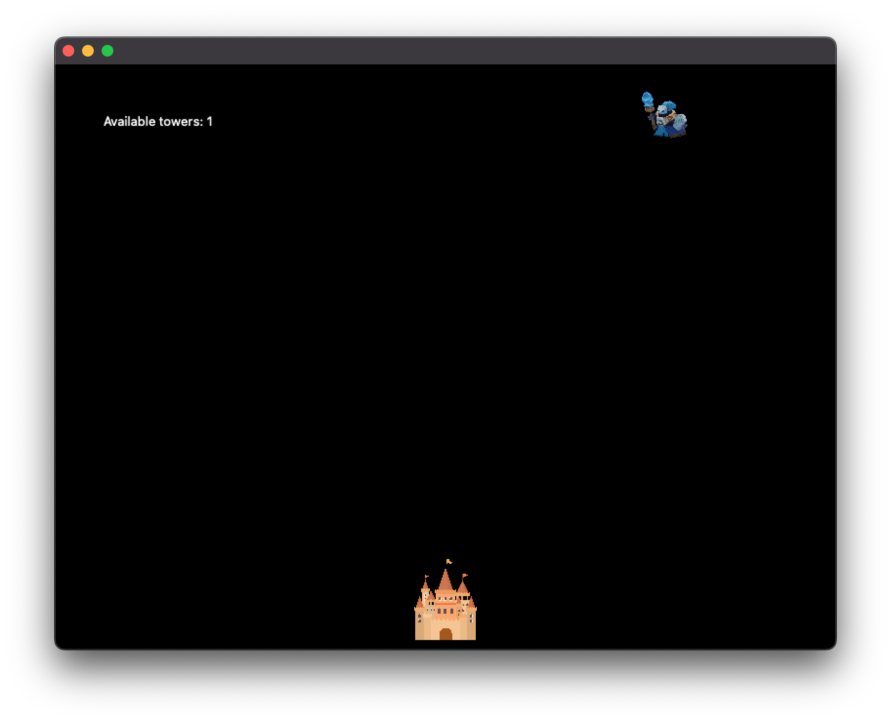
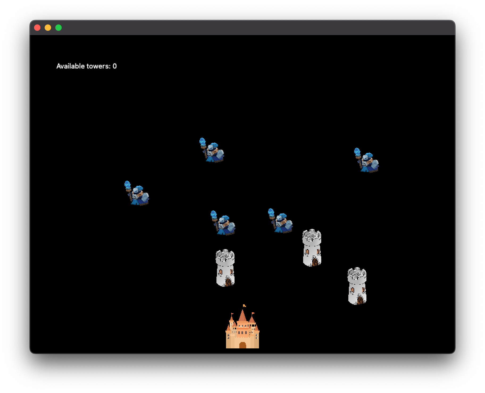

# Projekt SO2
## Spis treści
* [Gra obrona zamku](#general-info)
* [Graficzne przedstawienie gry]
* [Zastosowane technologie]
* [Autorzy]

## Gra obrona zamku
Nasza gra to klasyczny przykład koncepcji "Tower Defences". Na początku twożony jest zamek, który musimy bronić przed przeciwnikami. Przeciwnicy tworzeni są automatycznie co 5 sekund i startują z górnej połowy ekranu. W celu obrony zamku gracz może stawiac wieże obronne klikając lewym przyciskiem myszy na planszy. Wieże mają określony zasięg i pozwalają na niszczenie przeciwnkików, którzy chcą zdobyć nasz zamek. W lewym górnym rogu ekranu pojawia się informacja ile wież obronnych mamy aktualnie dostępnych do postawienia. Wraz z czasem trwania gry otrzymujemy kolejne wieże. W przypadku jeżeli  przeciwnik ominie obronę zamku i dostanie się na jego teren gracz przegrywa.

## Graficzne przedstawienie gry

- Na początku tworzymy plansze na której jest nasz zamek oraz przeciwnik co widać na poniższym obrazku:

- W lewym górnym rogu widzimy informację o dostępnych wieżach obronnych do postawienia. Jeżelimamy dostępne wieże to po kliknięciu lewym przyciskiem myszy zustaną one umieszczone na planszy w miejscu kursora. Możemy to zobaczyć na poniższym obrazku:

- Jeżeli przeciwnik ominie nasze wieże obronnne i dotrze do zamku to przegrywamy

## Zastosowane Technologie

### Python: 
Główny język programowania użyty do napisania aplikacji. Python jest popularnym językiem programowania ogólnego przeznaczenia, który oferuje wiele bibliotek i modułów, idealnych do tworzenia gier i aplikacji desktopowych. Wykożystaliśmy go ponieważ dostępne w nim wygodne korzystanie z wątków

### Wątki (Threading): 
Aplikacja korzysta z modułu threading w Pythonie do tworzenia i zarządzania wątkami. Wątki są używane do generowania przeciwników w grze, co pozwala na płynne działanie gry. Dla każdego przeciwnika tworzony jest osobny wątek za pomocą Thread z biblioteki threading.

### Sekcje krytyczne: 
W aplikacji istnieją dwie sekcje krytyczne, które są kluczowe dla poprawnego działania gry:
- Zdrowie przeciwników jest istotnym elementem gry, który wpływa na rozgrywkę. Wątki odpowiedzialne za obsługę logiki gry muszą zapewnić prawidłowe zarządzanie zdrowiem przeciwników. W przypadku błędów lub nieprawidłowego odjęcia punktów życia przeciwnikom, gra może stracić swoją zręcznościową dynamikę. 
- Poprawne śledzenie i aktualizowanie pozycji przeciwników jest kluczowe dla płynności i realizmu gry. Wątki odpowiedzialne za ruch przeciwników muszą stale aktualizować ich pozycję. Błędy w tej sekcji krytycznej mogą prowadzić do nieprawidłowego wyświetlania przeciwników, co negatywnie wpłynie na rozgrywkę. Należy zapewnić, aby logika aktualizacji pozycji przeciwników była optymalna i nie prowadziła do opóźnień w ruchu.

### PyQt: 
Biblioteka PyQt jest wykorzystywana do tworzenia interfejsu użytkownika w aplikacji desktopowej. PyQt to pakiet umożliwiający integrację biblioteki Qt, która jest popularnym zestawem narzędzi do tworzenia aplikacji graficznych, z językiem Python. Pozwala to na tworzenie estetycznych interfejsów użytkownika, obsługę zdarzeń, tworzenie okien dialogowych i wiele innych funkcji.

## Autorzy
Bartosz Gwiazda
Krzysztof Krajewski